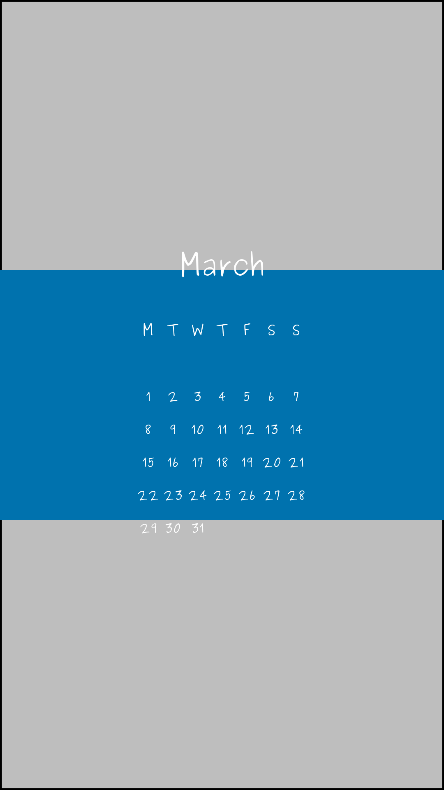

<!-- README.md is generated from README.Rmd. Please edit that file -->

```{r setup, include = FALSE}
knitr::opts_chunk$set(
  collapse = TRUE,
  comment = "#>",
  fig.path = "man/figures/README-",
  out.width = "100%",
  fig.align="center"
)
```

# wallpapr

wallpapr is a little toy `R` package to make desktop and phone backgrounds.
The design is inspired (aka copied one-to-one) by the beautiful calender wallpapers of [Emma](http://emmastudies.com).
You can check out her wallpapers at: [emmastudies.com/tagged/download](http://emmastudies.com/tagged/download).
With this package you can create your own calender wallpapers using an input image.

## Installation

You can install wallpapr from GitHub with:

``` r
# install.packages("remotes")
remotes::install_github("JBGruber/wallpapr")
```

## Examples

The package comes with two pictures you can use: a monochrome background in zima blue and a snapshot from the Isle of Mull I took:

```{r eval=FALSE}
library("wallpapr")
make_calendar_background(
  system.file("extdata", "zima.png", package = "wallpapr"),
)
```

    ## wallpaper saved as April.png

```{r example1, echo=FALSE, message=FALSE}
library("wallpapr")
make_calendar_background(
  system.file("extdata", "zima.png", package = "wallpapr"),
  filename = "man/figures/README-1.png"
)
```


By default, the wallpaper will have the same resolution and output format as the input image.
If you use an image of a different size than 1920x1080, you might have to fiddle around with the `text_size` and `headline_factor` options. Additionally, you can use a different font:

```{r eval=FALSE}
make_calendar_background(
  system.file("extdata", "zima_4k.png", package = "wallpapr"),
  family = "Purisa",
  text_size = 16,
  headline_factor = 2
)
```

    ## wallpaper saved as April.png

```{r example2, echo=FALSE, message=FALSE}
library("wallpapr")
make_calendar_background(
  system.file("extdata", "zima_4k.png", package = "wallpapr"),
  filename = "man/figures/README-2.png",
  family = "Purisa",
  text_size = 16,
  headline_factor = 2
)
```


Of course, the main thing you want to do is to use a stunning background image for your calendar wallpaper:

```{r eval=FALSE}
library("wallpapr")
make_calendar_background(
  system.file("extdata", "mull.jpg", package = "wallpapr"),
  family = "Purisa"
)
```

    ## wallpaper saved as April.jpg

```{r example3, echo=FALSE, message=FALSE}
library("wallpapr")
make_calendar_background(
  system.file("extdata", "mull.jpg", package = "wallpapr"),
  family = "Purisa",
  filename = "man/figures/README-3.jpg"
)
```


By default, the current month is used to produce the wallpaper.
If you want to plan ahead and get a calendar for a different month, enter either a date or the name of a month (produces the month of the current year).

```{r eval=FALSE}
library("wallpapr")
make_calendar_background(
  system.file("extdata", "mull.jpg", package = "wallpapr"),
  filename = "August.jpg"
  month = "August",
  family = "Purisa",
  start_monday = FALSE # change when the week starts for you
)
```

    ## wallpaper saved as August.jpg

```{r example4, echo=FALSE, message=FALSE}

make_calendar_background(
  system.file("extdata", "mull.jpg", package = "wallpapr"),
  month = "August",
  family = "Purisa",
  start_monday = FALSE, # change when the week starts for you
  filename = "man/figures/README-4.jpg"
)
```


It is also possible to use a wallpaper size different from the input image.
Make sure though that the input image is large enough (otherwise the additional space is filled with the `fill` colour):

```{r eval=FALSE}
make_calendar_background(
  system.file("extdata", "zima_4k.png", package = "wallpapr"),
  resolution = c(1080, 1920), # first number is width, second height
  family = "Purisa",
)
```

    ## wallpaper saved as April.png

```{r example5, echo=FALSE, message=FALSE}
make_calendar_background(
  system.file("extdata", "zima_4k.png", package = "wallpapr"),
  resolution = c(1080, 1920),
  family = "Purisa",
  filename = "man/figures/README-5.png"
)
```

<p align="center">
  
<p>

If you have a picture in a wrong size or without background colour, you can also use `fill` to fill the remaining space:

```{r eval=FALSE}
make_calendar_background(
  "https://www.r-project.org/logo/Rlogo.png",
  resolution = c(1080, 1920),
  colour = "black",
  fill = "darkseagreen",
  family = "Purisa",
  family = "Purisa",
)
```

    ## wallpaper saved as April.png

```{r example6, echo=FALSE, message=FALSE}
make_calendar_background(
  "https://www.r-project.org/logo/Rlogo.png",
  resolution = c(1080, 1920),
  colour = "black",
  fill = "darkseagreen",
  family = "Purisa",
  filename = "man/figures/README-6.png"
)
```

<p align="center">
  
<p>


